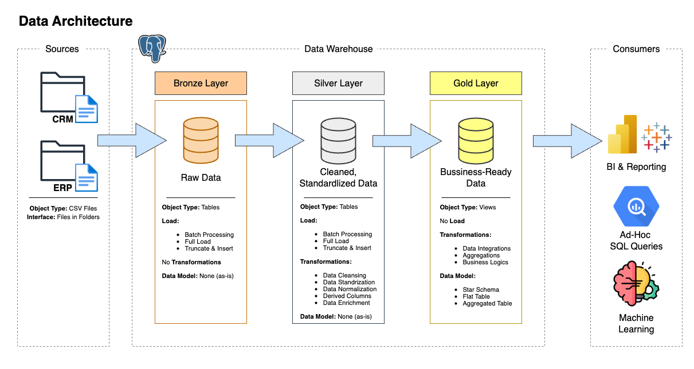

# Data Warehouse Project
## 📌 Data Architecture
This project use **Medallion Architecture** **(Bronze Layer, Silver Layer, Gold Layer)**



**Bronze Layer** (raw ingested data from CSV → Postgresql) → **Silver Layer** (cleansed, standardized, normalized data) → **Gold Layer** (business-ready star schema for reporting & analytics).

## 📘 Project Overview
This project involves:

1. **Data Architecture:** Designing a Modern Data Warehouse Using Medallion Architecture **Bronze**, **Silver**, and **Gold** layers.
2. **ETL Pipelines**: Extracting, transforming, and loading data from source systems into the warehouse.
3. **Data Modeling**: Developing fact and dimension tables optimized for analytical queries.

## 📂 File Structure
```
sql-data-warehouse-project/
|-- datasets/
|   |-- source_crm/
|   |   |-- cust_info.csv
|   |   |-- prd_info.csv
|   |   |-- sales_details.csv
|   |    
|   |-- source_erp/
|       |-- CUST_AZ12.csv
|       |-- LOC_A101.csv
|       |-- PX_CAT_G1V2.csv
|    
|-- docs/
|   |-- data_architecture.png
|   |-- data_flow.png
|   |-- data_integration.png
|   |-- data_model.png
|   |-- naming-conventions.md
|   |-- data_catalog.md
|
|-- scripts/
|   |-- bronze/
|   |   |-- ddl_bronze.sql
|   |   |-- proc_load_bronze.sql
|   | 
|   |-- silver/
|   |   |-- ddl_silver.sql
|   |   |-- proc_load_silver.sql
|   |
|   |-- gold /
|   |   |-- ddl_gold.sql
|   |
|   |-- init_database.sql
|
|-- tests/
|   |-- quality_checks_gold.sql
|   |-- quality_checks_silver.sql
|   
|-- LICENSE
|-- README.md
```